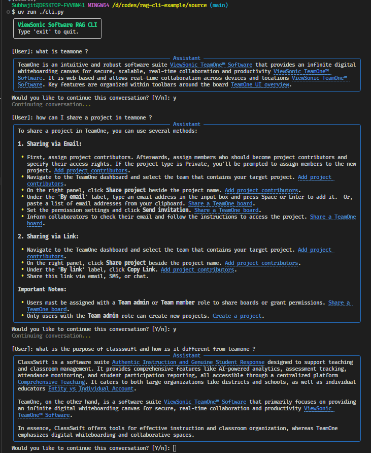

# rag-cli-example

Quick start and reproducible setup for new developers

**Prerequisites**
- Git
- Python 3.10+ (3.13 works)
- Docker & Docker Compose (for Qdrant and Ollama)
- Jupyter / JupyterLab (for the notebook)
- uv (recommended for Python deps, https://github.com/astral-sh/uv)

If you are on Windows, use PowerShell or Command Prompt; on macOS/Linux use a shell.

1) Pull latest code

	git pull origin main

2) Copy environment file

	cp .env.example .env
	# On Windows: copy .env.example .env

3) Create and activate a Python virtual environment

Windows (PowerShell):
	python -m venv .venv
	.\.venv\Scripts\Activate.ps1
Windows (cmd.exe):
	python -m venv .venv
	.\.venv\Scripts\activate.bat
macOS / Linux:
	python -m venv .venv
	source .venv/bin/activate

4) Install Python dependencies (recommended: uv)

	uv sync

If you don't have uv, install with pipx: pipx install uv

Alternatively, use pip:
	python -m pip install -e ./source

5) Choose your LLM provider

- **Ollama** (local):
	1. Start the Ollama service:
		cd deploys/ollama-deploy
		docker-compose up --build
	2. In your .env, set the LLM provider to Ollama (see .env.example)

- **Gemini** (cloud):
	1. Get your Gemini API key
	2. Edit .env and set the GEMINI_API_KEY variable
	3. Set the LLM provider to Gemini in .env

6) Start Qdrant DB and restore from backup

	cd deploys/qdrant-deploy
	docker-compose up --build

To restore a snapshot (replica DB):
	# Place your backup snapshot in deploys/qdrant-deploy/backups/
	# Follow Qdrant's restore instructions or use the provided scripts if available.

7) Start the backend server (local development)

	cd source
	python server.py

The notebook and cli clients expect the API at `http://localhost:8000/stream` — ensure the server is listening on port 8000.

8) Populate local DB (optional / if needed (snapshot restore fails))

	cd source
	python ingestion/populate_db.py

9) Open and run the notebook

Open `source/jpy-nb.ipynb` in Jupyter or JupyterLab and run the cells. The notebook contains a small async client that streams from `http://localhost:8000/stream`.

	jupyter lab source/jpy-nb.ipynb

10) Run CLI helpers

Or `source/cli.py`. You can run them from the `source` folder:

	cd source
	python cli.py <command>

11) Troubleshooting notes
- If imports fail, ensure the virtual environment is activated and dependencies installed.
- If the notebook cannot connect, confirm the server is running on port 8000 and `API_URL` in the notebook matches.
- Use `uv sync` or `pip install -e ./source` if dependencies are missing.

Files of interest
- [source/jpy-nb.ipynb](source/jpy-nb.ipynb) — example notebook that streams from the local server
- [source/server.py](source/server.py) — backend server entry point
- [source/ingestion/populate_db.py](source/ingestion/populate_db.py) — populate local DB
- [deploys/qdrant-deploy/docker-compose.yml](deploys/qdrant-deploy/docker-compose.yml) — Qdrant deployment

If everything runs smoothly, you will get similar output by running the cli.py 

